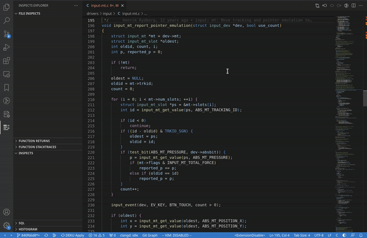
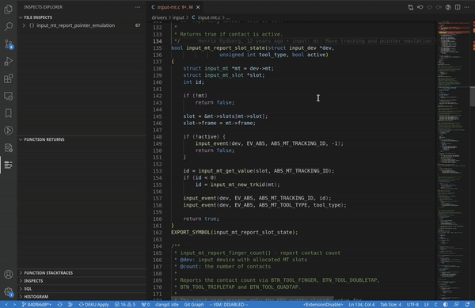

# The extension will be available in 2024

## Linux Kernel Inspect

This extension allows to inspect the Linux Kernel, i.e. watching the variables in the source code, measuring time of executing the function, checking who calls the function. It also allows queries to query for checking the values for specific variables.

### Inspect function variables

### Inspect function returns

### Youtube Video

### Requirements:
- own build kernel with LLVM (clang)
## Extension Dev
    npm install axios
    npm install crc-32